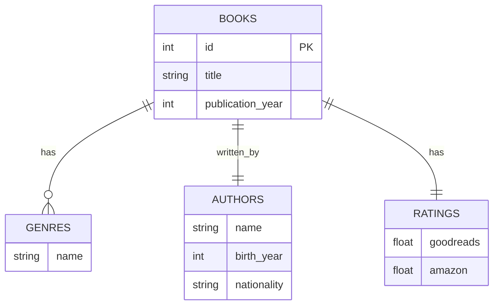
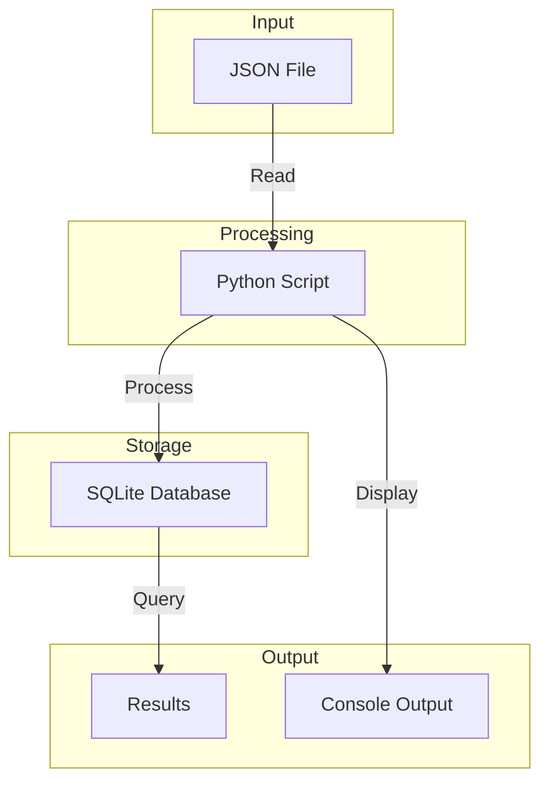
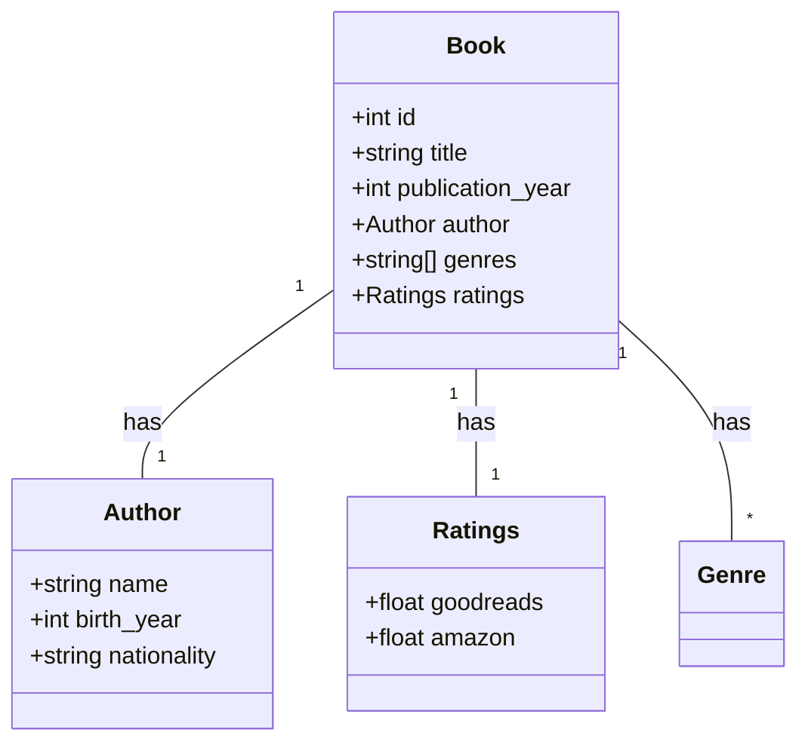
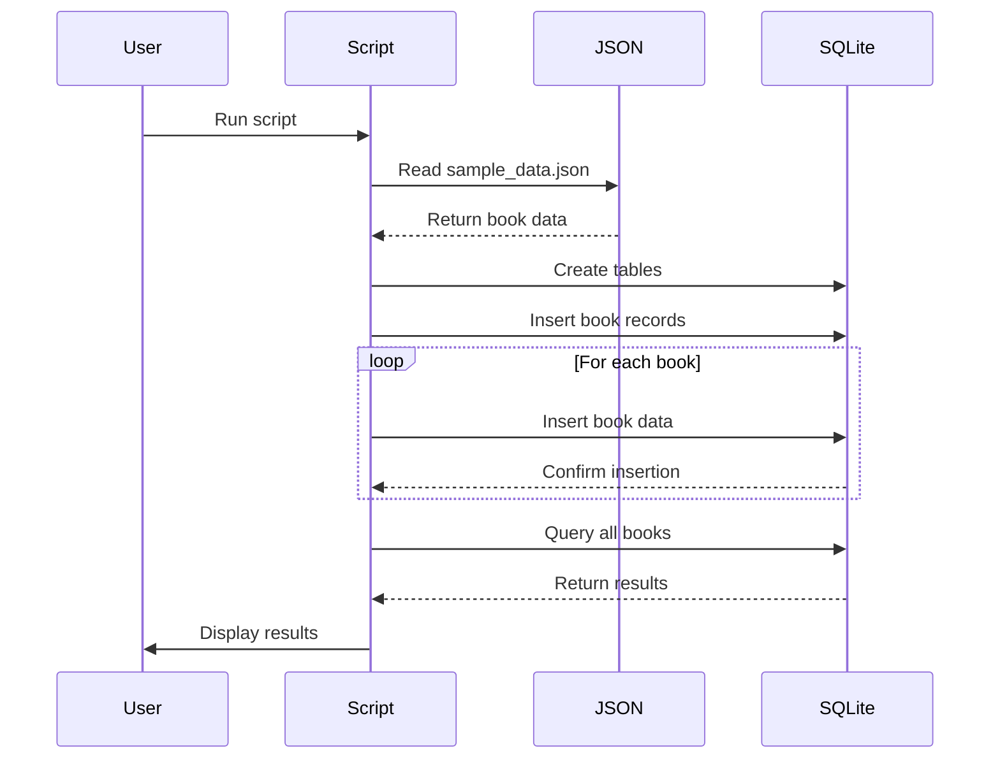
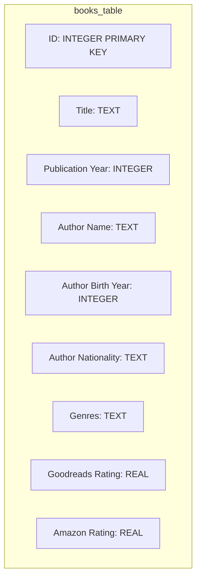
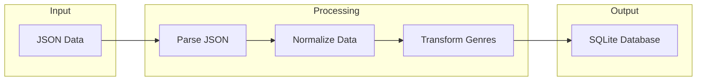

# Book Database Diagrams

## Entity Relationship Diagram (ERD)

## Data Flow Diagram

## Class Diagram

## Sequence Diagram

## Database Schema Visualization

## Data Processing Flow

These diagrams provide different perspectives on the book database system:

1. The ERD shows the relationships between different entities in the database
2. The Data Flow Diagram illustrates how data moves through the system
3. The Class Diagram represents the object-oriented structure of the data
4. The Sequence Diagram shows the step-by-step process of data handling
5. The Database Schema shows the actual table structure
6. The Data Processing Flow shows how the data is transformed from JSON to SQLite

Each diagram uses Mermaid's syntax and can be rendered in any Markdown viewer that supports Mermaid diagrams. 